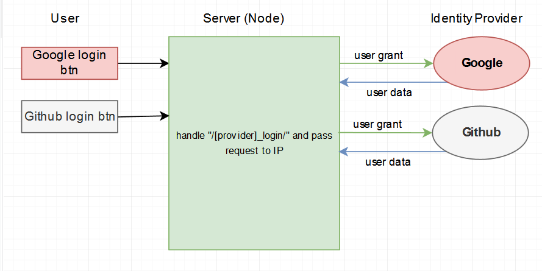
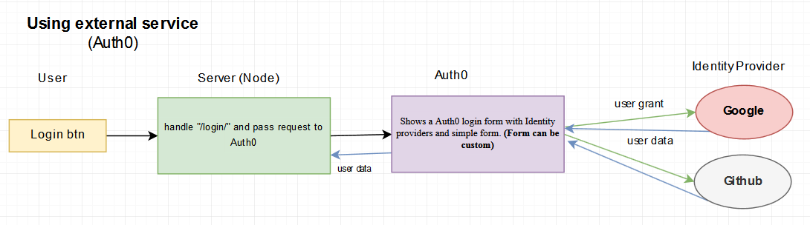

# Сервисы авторизаций
[Auth0 tutorial](https://auth0.com/docs/quickstart/webapp/nodejs/01-login#configure-auth0)

Содержание 
[[toc]]

--- 

### Сервисы
Есть популярные сервисы которые предлагают разбираться с аутентификацией, авторизацией, сбросом пароля, и т.д. на своей стороне. 

* [Auth0](https://auth0.com/)
* [Firebase authentication](https://firebase.google.com/docs/auth)
* [Okta](https://developer.okta.com/?_ga=2.201905943.741408621.1557473245-1906179534.1557304128)
* [AWS Cognito - требует добавляение кредитной карты](https://aws.amazon.com/ru/cognito/)

### Какая разница между OAuth & Auth0?
* **OAuth** - открытый протокол (схема) авторизации, который позволяет предоставить третьей стороне ограниченный доступ к защищённым ресурсам пользователя без необходимости передавать ей (третьей стороне) логин и пароль.

* **Auth0** - это сервис, который упрощает реализацию функций, связанных с проверкой подлинности(аутентификации, авторизации) для вашего приложения или сайта, использует OAuth.

### Плюсы и минусы OAuth без сервисов?

**Плюсы** 
* Независимость от сторонних сервисов
* Больше гибкости

**Минусы**
* Больше надо реализововать самому (сброс пароля, востановление пароля и т.д.)

### Плюсы и минусы OAuth с сервисами?
**Плюсы**
* Одна стратегия для passportjs
* Единая точка входа
* SSO(Single Sign-On)
* Использование уже готовой формы логина и сброс пароля
* Дашборд пользователей и приложений
* API
* Многофакторная аутентификация
* Вход в систему без пароля (passwordless)
* Управление пользователями

**Минусы**
* Зависимость от внешней системы
* Становиться платным, если пользователей много

