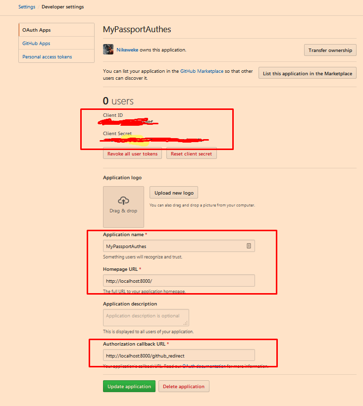

# OAuth - Github

```sh
npm i passport passport-github -S
```

1. Зайти на [сюда](https://github.com/settings/developers)
2. Создать свое приложение
3. Зайти в него и получить Client ID & Client Secret
4. Юзать по приципу OAuth Google

