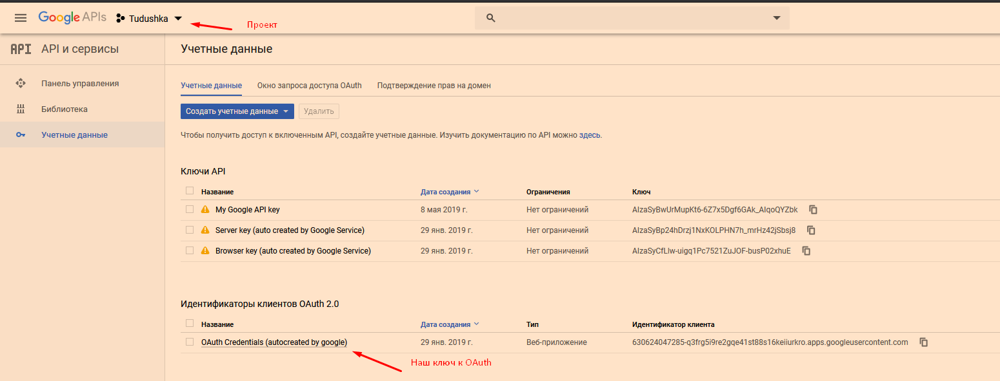
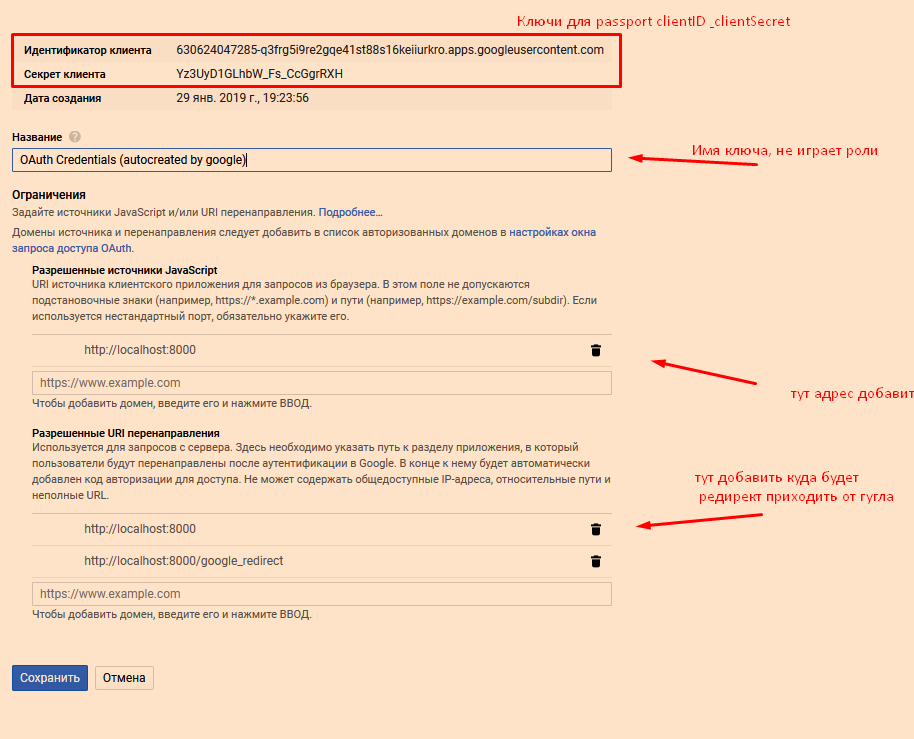
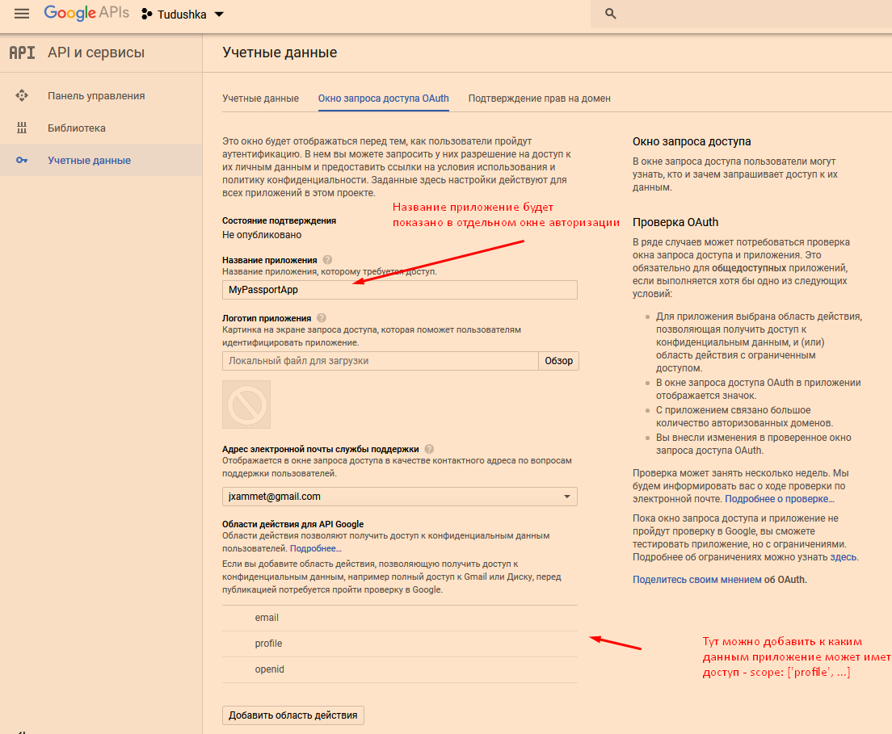
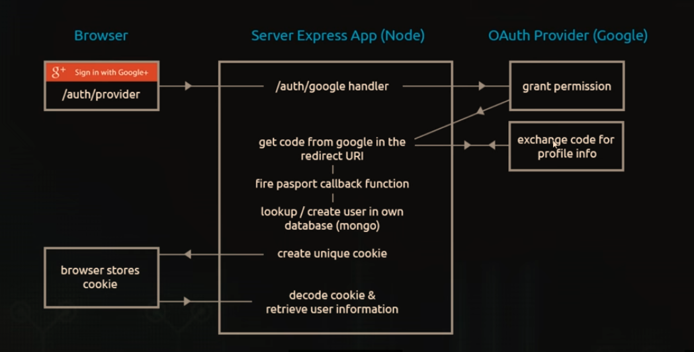

# OAuth - Google

1. **Passportjs** - пакет упрощяющий работу с OAuth & OpenID, который уже имеет стратегии для работы с разными сервисами
```sh
# google oauth strat
npm i passport passport-google-oauth20 -S
```

2. Зайти **Google API services console**
3. Нажать кнопку "включить API и сервисы"
4. Ищем `"Google+ API"`
5. Нажимаем включить
6. Там будет "Идентификаторы клиентов OAuth 2.0", заходим в первый ключ и берем из него "Идентификатор клиента" и "Секрет клиента" для passport-google-auth 





```js
// app.js
const express  = require('express')
const passport = require('./passport-setup')
const app      = express()

// home
app.get('/', (req, res) => {
	res.send(`
		<h2>Welcome to our MyPassportAuthes</h2>
		<a href="/google_login">Google login</a>
	`)
})
app.get('/fail', (req, res) => {
  res.send("Something went wrong")
})

// ==========================> AUTH routes
app.use(passport.initialize())

// google-auth
app.get('/google_login', passport.authenticate('google', {
	scope: ['profile'] // запрашиваемые данные пользователя от google 
}))

app.get('/google_redirect', passport.authenticate('google', { failureRedirect: '/fail' }), (req, res) => {
	res.send(`
		<h3>Authed by google successfuly</h3>
		<a href="/">Get back</a>
	`)
})


// Launch our app
const port = 8000;
const server = app.listen(port, function () {
    console.log('JWT listening on port ' + port);
});
```

```js
// passport-setup.js
const keys           = require('./keys')
const passport       = require('passport')
const GoogleStrategy = require('passport-google-oauth20')

// Setuping Google 
const googleOptions = {
  // callbackURL - этот же путь, но абсолютный(http://localhost:8000/google_redirect) 
  // должен быть в Google console "Разрешенные URI перенаправления".
  // Это может быть и главная страница
  callbackURL : '/google_redirect', 
  clientID    : keys.google.clientID,
  clientSecret: keys.google.clientSecret
}

const googleCallback = (accessToken, refreshToken, profile, done) => {
  console.log('ACCESS TOKEN =', accessToken)
  console.log('REFRESH TOKEN =', refreshToken)
  console.log('PROFILE = ', profile)
  /*
  #  Оперировать(добавлять/искать в БД) информацией пользователя нужно здесь, 
  #  дальше инфа не идет(то есть в обработчик редиректа)  
  */
  // без вызова этой функции не идет дальше выполнение программы
  done(null, profile) 
}

passport.use(new GoogleStrategy(googleOptions, googleCallback))

// без реализации этой функции - выдает ошибку
passport.serializeUser((user, done) => {
  console.log('SErializaing')
  done(null, user)
})

module.exports = passport
```

---

* Зачем нам нужен еще маршрут на редирект? Для того чтобы взамен на ключ, который даеться после запроса на google, взять информацию о пользователя из google

  