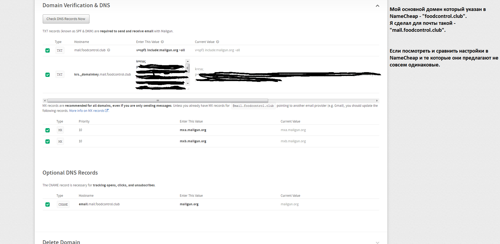
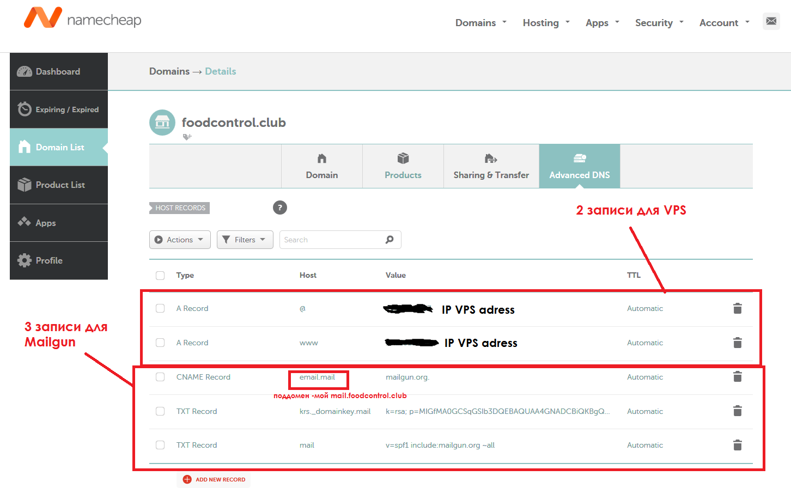
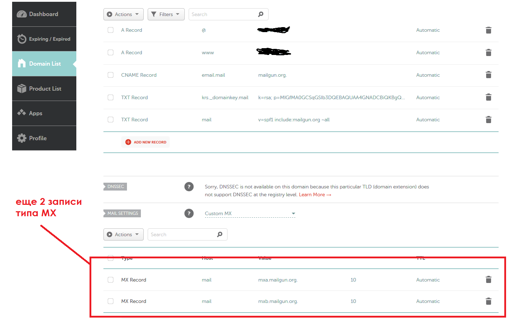

# Mailgun - mail service

### Данные для привязки почты (создание записей) к доменному имени находяться в Mailgun


### Создание записей в NameCheap для привязки почты

###### +3 записи


###### +2 записи MX типа



### Этапы верификации домена для почты
1. Создание записей в NameCheap
2. проверка галочек в Mailgun (DNS & Domain Verification)
3. проверка почты, туда приходит письмо о верификации домена (2-3 дня)
4. Если статус все еще "disabled" - создаем саппорт тикет (https://app.mailgun.com/app/support/list)
5. Описываем проблему - Bussines Verification
6. Отправляем им такое письмо:

```
Hello!

What types of emails will you be sending - transactional or marketing? transactional + marketing
 Register info, Reset password, Promo mail.

Where do you source your database of email addresses?
Host 1 plus - MYSQL

 Are all of your email addresses double-opt in?
I do not quite understand, but the mail has.

What is your expected monthly volume of messages?
1-5000, we have just started our project

Have you read our Email Best Practices document?
Yes!

Can you please give us the URL that your users use to sign up for your email as well as a link to your Terms of Service?
 In development, link to register page = http://foodcontrol.club/signup
```
