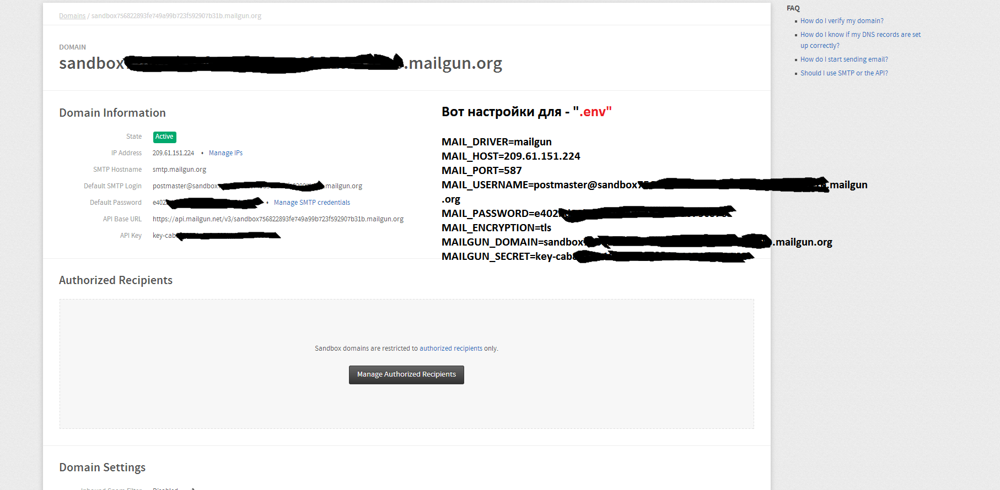

# Mailgun SMTP

#### Настройки для .env


###### .env
```
MAIL_DRIVER=mailgun
MAIL_HOST=209.61.151.224
MAIL_PORT=587
MAIL_USERNAME=postmaster@sandboxYYYYYYYYYYYYYYYYYYYYYYYYYY.mailgun.org
MAIL_PASSWORD=XXXXXXXXXXXXXXXXXXXXXXXXXXX
MAIL_ENCRYPTION=tls
MAILGUN_DOMAIN=sandboxYYYYYYYYYYYYYYYYYYYYYYYYYY.mailgun.org
MAILGUN_SECRET=key-cabZZZZZZZZZZZZZZZZZZZZZZZZZZZZZZZZ
```

###### example from php(Laravel)
```php
<?php

/*
  SMTP Mailgun способ

  Как юзать в других местах:

  1.
    use App\Mail\ResetPasswordMail;         // Подключить класс ResetPasswordMail - для сброса пароля
    use Illuminate\Support\Facades\Mail;    // Фасад Mail для отправки

2.
   $mail = new ResetPasswordMail($new_pwd);  // создать письмо
   Mail::to($user['email'])->send($mail);    // отправить с помощью Laravel - Mail Facade
*/

namespace App\Mail;

use Illuminate\Bus\Queueable;
use Illuminate\Mail\Mailable;
use Illuminate\Queue\SerializesModels;
use Illuminate\Contracts\Queue\ShouldQueue;

class ResetPasswordMail extends Mailable
{
    use Queueable, SerializesModels;

    private $viewArgs = array();


    /**
     * Create a new message instance.
     *
     * @return void
     */
    public function __construct($new_password)
    {
        $this->viewArgs['new_password'] = $new_password;
    }


    /**
     * Build the message.
     *
     * @return $this
     */
    public function build()
    {
      $subject =   'Ваш пароль был сброшен';

      return $this->from("foodcontrol@club.mail")
                  ->subject($subject)
                  ->view('mail.recover_password', $this->viewArgs);
    }
}

```