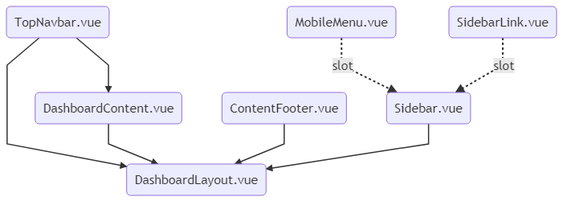

# Mermaid 
### make chart with text
* [Mermaid](https://mermaidjs.github.io/usage.html)

#### Links
```html
<link rel="stylesheet" href="https://cdn.rawgit.com/knsv/mermaid/0.5.6/dist/mermaid.css">

<div class="mermaid">CODE HERE</div>

<script src="https://cdnjs.cloudflare.com/ajax/libs/mermaid/7.1.2/mermaid.js"></script>
```

#### CLI - can output png, pdf, svg, ... on file mermaid
```
npm install -g mermaid.cli
```

```
mmdc -i input.mmd -o output.svg
```
```
mmdc -i input.mmd -o output.png
```
```
mmdc -i input.mmd -o output.pdf
```

#### Example
```
graph TB
      id1(TopNavbar.vue) 
      id2(DashboardContent.vue)
      id3(ContentFooter.vue)
      id4(Sidebar.vue)
      id5(SidebarLink.vue)
      id6(MobileMenu.vue)
      id7(DashboardLayout.vue)

      id1 --> id7
      id2 --> id7
      id3 --> id7
      id4 --> id7

      id6 -. slot .-> id4
      id5 -. slot .-> id4
      id1 --> id2
```
**Output**
