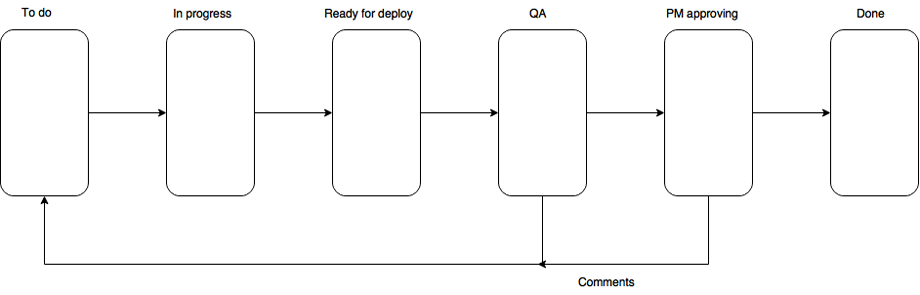

# Project at nowadays

* [Express - best practices security](https://expressjs.com/ru/advanced/best-practice-security.html)
* [Express - best practices performance](https://expressjs.com/ru/advanced/best-practice-performance.html)

---

На сегодня серьезный проект должен состоять из:
[[toc]]

### Аутентификация, авторизация
Должна быть возможность локальной аутентификации и также через других провайдеров(Google, Facebook, ...)

### База данных
Как реляционные так и NoSQL варианты

### Тесты
Написание тестов для функций и их проверка

### CI/CD
Использование сервисов для проверки приложение посредством прогонки тестов, после пуша в репозиторий. *Тесты тесно связаны с CI/CD.*

### Linter 
Для общего стиля кода в команде

### Loggers
Логгеры как локальные(`winston`), так и сервисы(`Sentry`)

### Git-Flow
[Git-flow](http://ruwhynot.com/2016/03/08/briefly-about-gitflow/) — наиболее популярная методология разработки проектов с использованием git, где под каждое задание делаеться ветка(feature/SOME-TASK-12) и потом после завершения, делаеться запрос на слияния с develop веткой. Запрос рассмматриваеться другим программистом, вышим по статусу, и он принимает или не принимает слияние.

### Kanban
Доска с колонками и перетаскивание заданий в ней.



* To do — спринт бэклог.
* In progress — задачи, которые разрабатываются в данный момент.
* Ready for deploy — задачи, которые уже выполнены, но не представлены в тестовом окружении.
* QA — задачи, готовые к тестированию.
* PO/PM approving — готовые задачи проходят проверку project owner-ом или проектным менеджером.
* Done — выполненные (завершённые) задачи текущего спринта.  

### Nginx на входе
Установить nginx как распределитель нагрузки

### В приложении
* Хранилище сессий пользователей (то есть в браузере храниться только ID сессии, а инфа на сервере сидит)
* Использование протокола - HTTP2 (ему нужны сертфикаты, но их можно сделать локально)
* Использовать сжатие gzip
* Использование HTTPS(TLS)
* Обеспечение защиты зависимостей
* Использование middleware

### Управление задачами
Каждый проект содержит которые определяються разным описанием, типом, временем выполнения и т.д. Для этого нужно использовать системы типа [Asana](https://asana.com/)(free), Jira(not-free)

### Версинирование и CHANGELOG
Если продукт являеться приватным для использования в компании, тогда удобно делать [семантическое версинирование(x.y.z)](https://semver.org/lang/ru/) и вести [CHANGELOG](https://keepachangelog.com/ru/0.3.0/) чтобы потребитель понимал что вошло в ту или другую версию. Повышение версии делаеться каждый конец недели. Если всю неделю были bugfixes, делаем - **patch**;
Если новый функционал - **minor**, несовместимый функционал с пред. версией - **major**.
```bash
# повысит "z" (x.y.z)
npm version patch 

# повысит "y" и обнулит "z" (x.y.z)
npm version minor

# повысит "x" и обнулит "y", "z" (x.y.z)
npm version major
``` 


